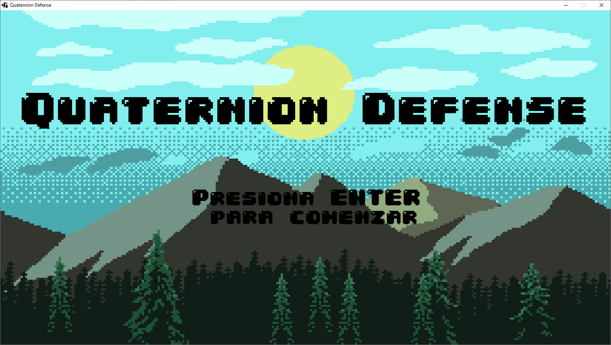

### Quaternion Defense

## Desarrolladores

- Cabral Sebastián
- Mallet Germán
- López Alva Diana

Todos somos estudiantes de Paradigmas de Programación en la UTN.

El juego nos pone al mando de un grupo de sobrevivientes que tendran que defenderse de las oleadas de zombies que vendran.
Para ello los sobrevivientes deberan para recolectar recursos del mapa interactuando con ellos y obtener objetos que los zombies dejan al morir.
Los sobrevivinetes podran combinar algunos estos objetos para asi construir equipos y estructuras que los ayudarán a defenderse. 
Cada sobreviviente cuenta con estadisticas y habilidades únicas que se potenciaran a medida que el sobreviviente sube de nivel.
Para subir de nivel los sobrevivientes deberan derrotar zombies.

Experiencia Para Pasar de Nivel
 Para nivel 2 = 4
 Para nivel 3 = 9
 Para nivel 4 = 16

## Sobrevivientes

### Jan
  Vida: Medio
  Ataque: Alto
  Defensa: Alto
  Habilidad: Al estar equipado con sus manos duplica su ataque y gana daño perforante (5 +   1 * asesinato).

### Karl
  Vida: Muy Bajo
  Ataque: Medio
  Defensa: Medio
  Habilidad: Posee un escudo igual a su vida máxima que se regenera cada 5 segundos.

### Betty
  Vida: Alto
  Ataque: Bajo
  Defensa: Bajo
  Habilidad: Cada 3er ataque cura 5% de vida máxima.

### Moldor
  Vida: Medio
  Ataque: Muy Bajo
  Defensa: Muy Alto
  Habilidad: Puede cambiar a un modo oscuro lo que intercambia ataque por defensa (incluyendo bonuses de equipos).

## Enemigos

### Zombie Tipo 1
  Vida: Medio
  Ataque: Bajo
  Defensa: Bajo
  Habilidad: Pueden(20%) infligir Sangrado(1) con sus ataques.
  Experiencia Que Da: 1

### Zombie Tipo 2
  Vida: Bajo
  Ataque: Bajo
  Defensa: Bajo
  Habilidad: Puede(30%) revivir una vez.
  Experiencia Que Da: 1

### Zombie Gordo
  Vida: Medio
  Ataque: Medio
  Defensa: Medio
  Habilidad: Puede infligir Ceguera(1) con sus ataques y al morir explota causando mucho daño y Ceguera(3) a los sobrevivientes en un rango de 4 casillas.
  Experiencia Que Da: 2

### Zombie Tanque
  Vida: Alto
  Ataque: Alto
  Defensa: Alto
  Habilidad: Recupera un 30% del saño infligido.
  Experiencia Que Da: 3

## Estados Alterados
 Los estados alterados son un efecto temporal negativo que puede sufrir un persojanje.
 Todos tienen una duración propia y un nivel de gravedad que potenciará el efecto del estado.
 Los estados alterados tienen un efecto al aplicarse, que es cuando se inglige un nuevo estado alterado sobre un personaje que no sufria dicho estado,
 y otro efecto al reaplicarse, que sucede cuando se inglinge un nuevo estado alterado sobre un personaje que ya tenía un estado alterado del mismo tipo.

### Quemadura
 Duración: 5 seg.
 Al aplicar: Causa (gravedad)% de daño por segundo.
 Al reaplicar: Se reinicia la duracion y se establece como gravedad la mayor de entre la quemadura nueva y la anterior.

### Sangrado
 Duración: 3 seg.
 Al aplicar: Aumenta el daño recibido en (gravedad).
 Al reaplicar: Se reinicia la duracion y incrementa la gravedad del sangrado en el doble de la gravedad del nuevo sangrado.

### Ceguera
 Duración: 6 seg.
 Al aplicar: Driminiye la presicion en 10 * (gravedad).
 Al reaplicar: Se reinicia la duracion y incrementa la gravedad de la ceguera en la gravedad de la nueva ceguera.

### Escarcha
 Duración: 3 seg.
 Al aplicar: 
	Disminuye la probabilidad de bloqueo en (gravedad)%
	Disminuye la probabilidad de evasión en (gravedad)%
	Disminuye el ataque en (gravedad)
 Al reaplicar: Se reinicia la duracion y incrementa la gravedad de la escarcha en la gravedad de la nueva escarcha.
 Al llegar a nivel 5 de gravedad se convierte en congelado(3).
 No puede aplicarse si el personaje esta congelado.

### Congelado
 Duración: (gravedad) seg.
 Al aplicar: Inmoviliza totalmente e inhabilita ataques y habilidades.
 Al reaplicar: Incrementa la gravedad del congelado en la gravedad del nuevo congelado.

## Items

## Equipos

### Armas

Ángel Guardián:
  Ataque: 42
  Defensa: 15
  Rango: 1-1
  Efecto: Auto-Revivir

Espada De Entrenamiento:
  Ataque: 12
  Defensa: 5
  Rango: 1-1
  Efecto: 5to Ataque: +1 Exp

Katana:
  Ataque: 35
  Defensa: 25
  Rango: 1-1
  Efecto: 30% de Infligir Sangrado(2)

Espada Corta:
  Ataque: 28
  Defensa: 5
  Rango: 1-1
  Efecto: Probabilidad de Evasión y Crítico +15%     

Espada Recta:
  Ataque: 22
  Defensa: 5
  Rango: 1-1
  Efecto: Probabilidad de Bloqueo +20%

Espada Perforante:
  Ataque: 46
  Defensa: 5
  Rango: 1-1
  Efecto: 5to Ataque: Ataque Perforante

Espada Grande:
  Ataque: 37
  Defensa: 15
  Rango: 1-1
  Efecto: -

Antorcha:
  Ataque: 15
  Defensa: 0
  Rango: 1-1
  Efecto: Infligir Quemadura(3)

Arco:
  Ataque: 32
  Defensa: 0
  Rango: 1-4
  Efecto: -

Manos:
  Ataque: 5
  Defensa: 0
  Rango: 1-1
  Efecto: -

### Equipos de Mano

Escudo Redondo:
  Defensa: 25
  Reducción De Daño: 3
  Efecto: Probabilidad de Bloqueo +30%

Anillo Lujoso:
  Defensa: 36
  Reducción De Daño: 3
  Efecto: Daño Realizado +20%
          Daño Recibido +20%

Brazalete De Oro:
  Defensa: 20
  Reducción De Daño: 1
  Efecto: Vida máxima +15%

### Cascos

Collar De Oro:
  Defensa: 12
  Reducción De Daño: 1
  Efecto: Vida máxima +15%

Collar Salvaje:
  Defensa: 12
  Reducción De Daño: 1
  Efecto: Aumenta el daño realizado en 20%

Casco De Cuero:
  Defensa: 24
  Reducción De Daño: 2
  Efecto: Aumenta la vida máxima en 50

Casco De Paladín:
  Defensa: 42
  Reducción De Daño: 3
  Efecto: Reduce el daño recibido en 25%

Casco De Gladiador:
  Defensa: 42
  Reducción De Daño: 3
  Efecto: Aumenta el daño realizado en 25%

### Pecheras

Camisa Verde:
  Defensa: 10
  Reducción De Daño: 1
  Efecto: Probabilidad de Evasión +10%

Armadura Ligera De Cuero:
  Defensa: 26
  Reducción De Daño: 2
  Efecto: Probabilidad de Evasión +20%

Armadura Ligera De Hierro:
  Defensa: 41
  Reducción De Daño: 2
  Efecto: Probabilidad de Evasión +10%

Camisa Azul:
  Defensa: 26
  Reducción De Daño: 2
  Efecto: -

Armadura Pesada:
  Defensa: 55
  Reducción De Daño: 3
  Efecto: Refleja 25% de Daño Recibido

Armadura De Paladin:
  Defensa: 55
  Reducción De Daño: 2
  Efecto: Vida máxima +20%

Alas De Angel:
  Defensa: 12
  Reducción De Daño: 1
  Efecto: Cura 5% de la vida máxima cada 5 segundos

### Pantalones

Calzoncillos:
  Defensa: 5
  Reducción De Daño: 1
  Efecto: -

Pantalones Largos:
  Defensa: 36
  Reducción De Daño: 3
  Efecto: Vida máxima +15%

Pantalones Cortos:
  Defensa: 12
  Reducción De Daño: 2
  Efecto: En 3er Ataque Recibido: Evasión +100%

### Botas

Botas de Cuero:
  Defensa: 24
  Reducción De Daño: 2
  Efecto: Vida máxima +15%

Botas de Hierro:
  Defensa: 36
  Reducción De Daño: 3
  Efecto: -

### Materiales

Diamante: Piedra preciosa útil para combinar.

Ruby: Piedra preciosa útil para combinar.

Cuero: Cuero de zombie?. Útil para combinar.

Pluma: Zombies con plumas? Útil para combinar.

Palo: Pueden obtenerse de arboles. Útil para combinar.

Garra: Peligrosa Garra de zombie. Útil para combinar.

Cuerda: Una Cuerda. Útil para combinar.

### Recursos

Madera: recurso básico de construcción obtenible
mediante la tala de árboles. Útil para construcciones,
fabricación de armas y otros objetos.

Piedra: recurso básico de construcción obtenible
de las grandes rocas. Útil para construcciones,
fabricación de armas y otros objetos.

Hierro: recurso básico de construcción obtenible
en las minas de hierro. Útil para construcciones,
fabricación de armas y otros objetos.

Oro:recurso básico de construcción obtenible
en las minas de oro. Útil para construcciones,
fabricación de armas y otros objetos.

### Consumibles

Hierba verde: una planta medicinal que puede encon_
trarse en los arbustos silvestres, y en ocasiones
extraerse de los árboles. Aumenta en 15% la salud 
del personaje que lo utiliza (consumible).

## Habilidades

### Pasivas

Valentía:
  Aumenta el ataque del personaje en 17/19/21/23/25 %.
Valentía+:
  Aumenta el ataque del personaje en 27/29/31/33/35 %.
Valentía++:
  Aumenta el ataque del personaje en 37/39/41/43/45 %.

Vida:
  Aumenta la vida del personaje en 17/19/21/23/25 %.
Vida+:
  Aumenta la vida del personaje en 27/29/31/33/35 %.
Vida++:
  Aumenta la vida del personaje en 37/39/41/43/45 %.

Escudo:
  Aumenta la defensa del personaje en 17/19/21/23/25 %.
Escudo+:
  Aumenta la defensa del personaje en 27/29/31/33/35 %.
Escudo++:
  Aumenta la defensa del personaje en 37/39/41/43/45 %.

Protección:
  Reduce en 17/19/21/23/25 % el daño recibido por el personaje.
Protección+:
  Reduce en 27/29/31/33/35 % el daño recibido por el personaje.
Protección++:
  Reduce en 37/39/41/43/45 % el daño recibido por el personaje.

Aceleración:
  Aumenta la velocidad del personaje en 5/10/15/20/25 %.
Aceleración+:
  Aumenta la velocidad del personaje en 20/25/30/35/40 %.
Aceleración++:
  Aumenta la velocidad del personaje en 35/40/45/50/55 %.

Bloqueo:
  Aumenta la probabilidad de bloqueo en 7/9/11/13/15 %.
Bloqueo+:
  Aumenta la probabilidad de bloqueo en 17/19/21/23/25 %.
Bloqueo++:
  Aumenta la probabilidad de bloqueo en 27/29/31/33/35 %.

Precisión:
  Aumenta la precisión del personaje en 7/9/11/13/15 %.
Precisión+:
  Aumenta la precisión del personaje en 17/19/21/23/25 %.
Precisión++:
  Aumenta la precisión del personaje en 27/29/31/33/35 %.

Crítico:
  Aumenta la probabilidad de crítico por el personaje.
  en 7/9/11/13/15 %.
Crítico+:
  Aumenta la probabilidad de crítico por el personaje.
  en 17/19/21/23/25 %.
Crítico++:
  Aumenta la probabilidad de crítico por el personaje.
  en 27/29/31/33/35 %.

Daño Crítico:
  Aumenta el daño crítico en 20/40/60/80/100 %.
Daño Crítico+:
  Aumenta el daño crítico en 30/60/90/120/150 %.
Daño Crítico++:
  Aumenta el daño crítico en 40/80/120/160/200 %.

Despiadado:
  Aumenta:
    - La probabilidad de crítico en 7/9/11/13/15 %.
    - El daño crítico en 20/40/60/80/100 %.
Despiadado+:
  Aumenta:
    - La probabilidad de crítico en 17/19/21/23/25 %.
    - El daño crítico en 30/60/90/120/150 %.

Auto Revivir:
  Al recibir daño letal: El personaje queda derribado durante 4 seg.
    y se levanta con 20/25/30/35/40 % de vida.
  Enfriamiento: 90/85/80/75/70 seg.

Angel Interno:
  Reduce el daño recibido e infligido en 7/14/21/28/35%.
  Moldor Oscuro: Se transforma en Demonio Interno.

Demonio Interno:
 Aumenta el daño recibido e infligido en 7/14/21/28/35%.

### Activas

Regeneración:
  En la activación: Cura 3% de vida cada 2 seg al personaje
    durante 10/10/15/20/20 seg.
  Enfriamiento: 56/52/48/44/40 seg.
Regeneración+:
  En la activación: Cura 5% de vida cada 2 seg al personaje durante
    10/10/15/20/20 seg.
  Enfriamiento: 56/52/48/44/40 seg.
Regeneración++:
  En la activación: Cura 7% de vida cada 2 seg al personaje durante
    10/10/15/20/20 seg.
  Enfriamiento: 56/52/48/44/40 seg.

Cura:
  En la activación: Cura 5/10/15/20/25  % de vida.
  Enfriamiento: 20/18/16/14/12 seg.
Cura+:
  En la activación: Cura 15/20/25/30/35  % de vida.
  Enfriamiento: 23/21/18/16/14 seg.
Cura++:
  En la activación: Cura 25/30/35/40/45  % de vida.
  Enfriamiento: 26/24/22/20/18 seg.

Revivir:
  En la activación: Levanta un personaje derribado con 10/20/30/40/50 % de vida.
  Enfriamiento: 90/85/80/75/70 seg.
Revivir+:
  En la activación: Levanta un personaje derribado con 20/40/60/80/100 % de vida.
  Enfriamiento: 90/85/80/75/70 seg.
Revivir++:
  En la activación: Levanta todos los personajes derribados con
    20/40/60/80/100 % de vida.
  Enfriamiento: 99 seg.

Cocktail Molotov:
  Lanza un cocktail molotov 6 casillas hacia adelante. Tras 0,2 seg. cae y prende fuego un área de 3x3.
  Quema todo en las casillas con una gravedad de 2/2/3/4/4.
  Enfriamiento: 28/26/24/22/20 seg.

Flechazo Simple:
  En la activación: Lanza una flecha que inflige daño.
  Daño: Ataque + 10/20/30/40/50 %.
  Enfriamiento: 18/17/16/15/14 seg.

Flechazo Ígneo:
  En la activación: Lanza una flecha que inflige daño y quemadura(3).
  Daño: Ataque + 10/20/30/40/50 %.
  Enfriamiento: 18/17/16/15/14 seg.

Flechazo Gélido:
  En la activación: Lanza una flecha que inflige daño y escarcha(3).
  Daño: Ataque + 10/20/30/40/50 %.
  Enfriamiento: 18/17/16/15/14 seg.

Flechazo Oscuro:
  En la activación: Lanza una flecha que inflige daño y ceguera(3).
  Daño: Ataque + 10/20/30/40/50 %.
  Enfriamiento: 18/17/16/15/14 seg.

Flechazo Perforante:
  En la activación: Lanza una flecha que inflige daño y sangrado(3).
  Daño: Ataque + 20/40/60/80/100 %.
  Enfriamiento: 26/25/24/23/22 seg.

Ataque Simple:
  En la activación: Realiza un ataque potenciado con el arma equipada.
  Daño: Ataque + 10/20/30/40/50 %.
  Enfriamiento: 26/25/24/23/22 seg.
Ataque Ígneo:
  En la activación: Realiza un ataque potenciado con el arma equipada e inflige quemadura(2).
  Potenciación: 10/20/30/40/50 %.
  Enfriamiento: 16/14/12/10/8 seg.

Ataque Gélido:
  En la activación: Realiza un ataque potenciado con el arma equipada e inflige escarcha(2).
  Potenciación: 10/20/30/40/50 %.
  Enfriamiento: 16/14/12/10/8 seg.

Ataque Oscuro:
  En la activación: Realiza un ataque potenciado con el arma equipada e inflige ceguera(2).
  Potenciación: 10/20/30/40/50 %.
  Enfriamiento: 16/14/12/10/8 seg.

Ataque Perforante:
  En la activación: Realiza un ataque potenciado que ignora 50% de la defensa con el arma equipada e inflige sangrado(2).
  Potenciación: 10/20/30/40/50 %.
  Enfriamiento: 20/18/16/14/12 seg.

Ataque de Experiencia:
  En la activación: Realiza un ataque potenciado y gana 1/1/2/3/3 experiencia.
  Potenciación: 10/20/30/40/50 %.
  Enfriamiento: 26/24/22/20/18 seg.

Bendición:
  En la activación: Cura 30/40/50/60/70 % de vida a todos los sobrevivientes.
  Enfriamiento: 20/18/16/14/12 seg.
  Moldor Oscuro: Se transforma en Maldición.

Maldición:
  En la activación: Daña a todos los enemigos.
  Daño: Ataque + 30/60/90/120/150%
  Enfriamiento: 20/18/16/14/12 seg.

Cambio De Energias:
  En la activación: Cura 5% de vida y cambia el modo.
  Enfriamiento: 5/5/4/3/3 seg.

## Guía de Recetas

### Armas
	Palo(10) + Madera(15) = Espada De Entrenamiento
	Espada De Entrenamiento + Piedra(25) = Katana
	Espada De Entrenamiento + Hierro(25) = Espada Corta
	Palo(10) + Hierro(15) = Espada Recta
	Espada Recta + Hierro(25) = Espada Grande
	Espada Grande + Alas De Angel = Angel Guardian	
	Palo(20) + Cuerda(5) = Arco
		
### Equipos de Mano
	Madera(30) + Piedra(30) = Escudo Redondo
	Brazalete De Oro() + Diamante(10) = Anillo Lujoso
	Oro(30) + Hierro(30) = Brazalete De Oro
		
### Cascos
	Oro(25) + Cuerda(3) = Collar De Oro
	Garra(10) + Cuerda(3) = Collar Salvaje
	Cuero(10) + Cuerda(3) = Casco De Cuero
	Rubi(15) + Casco DeCuero = Casco De Paladin
	Collar Salvaje + Casco De Cuero = Casco De Gladiador
		
### Pecheras
	Cuero(10) + Hierba Verde(10)} = Camisa Verde
	Cuero(10) + Rubi(10) = Camisa Azul
	Cuero(10) + Camisa Verde = Armadura Ligera De Cuero
	Camisa Verde + Hierro(20) = Armadura Ligera De Hierro
	Camisa Azul + Rubi(15) = Armadura De Paladin
	Camisa Azul + Hierro(35) = Armadura Pesada
	Pluma(25) + Diamante(5) = Alas De Angel
  
### Pantalones
	Calzoncillos + Pluma(10) = Pantalones Cortos
	Calzoncillos + Cuero(10) = Pantalones Largos
		
### Botas
	Botas Viejas + Cuero(15) = Botas De Cuero
	Botas Viejas + Hierro(25) = Botas De Hierro
		
### Estructuras
	Escudo Redondo + Madera(50) = Muro De Madera
	Escudo Redondo + Piedra(50) = Muro De Piedra
	Arco + Piedra(50) = Torre De Piedra
